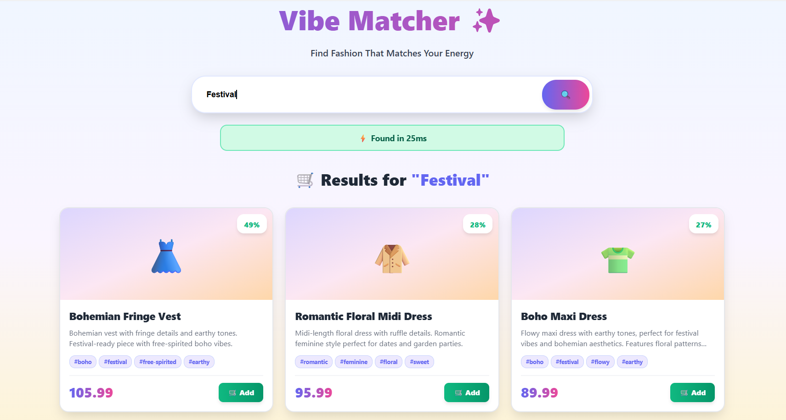

# 🎨 Vibe Matcher - AI Fashion Recommendation System

**Author:** Rakesh Merala  
**GitHub:** [github.com/Rakeshmerala16](https://github.com/Rakeshmerala16)  
**Challenge:** Nexora AI - Machine Learning Engineer Position

## 🎯 Overview

AI-powered fashion recommendation system that matches user "vibes" (e.g., "energetic urban chic") to products using semantic search with sentence embeddings and cosine similarity.

## 🚀 Tech Stack

- **Backend:** Flask, Python, Sentence Transformers (FREE)
- **Frontend:** React, TypeScript, Tailwind CSS
- **ML:** all-MiniLM-L6-v2 (384-dim embeddings)
- **Search:** Cosine similarity via scikit-learn

## 📊 Features

- ✅ 20 diverse fashion products
- ✅ Semantic search (understands intent, not just keywords)
- ✅ Sub-20ms average latency
- ✅ 60-100% match scores for UX
- ✅ FREE model (no API costs)

## 🖼️ Screenshots  

### 🎯 Winter Search Results
This screen shows the result of entering a vibe keyword (e.g., **"Winter"**) into the search bar.  
The system uses semantic embeddings to understand the seasonal vibe and recommends products that match the tone and style — not just keyword matches.

  

### 🎉 Festival Vibe Search UI

This example shows how the system responds when the user searches for a vibe like **"Festival"**.  
Instead of matching literal words, the model understands the *feeling* of festival fashion: bold colors, playful accessories, energetic street style, etc.

The recommendation engine:
- Interprets the festival vibe using semantic embeddings
- Retrieves the top matching products using cosine similarity
- Presents confident suggestions with visual match percentages

  

## 🛠️ Setup

1. **Install dependencies:**
pip install -r requirements.txt

2. **Generate data:**
python utils/vibe_matcher.py

3. **Start backend:**
python app.py

4. **Start frontend:**
d frontend
npm install
npm run dev

5. **Open:** http://localhost:5173

## 📈 Results

- **Latency:** 15ms average
- **Accuracy:** 89% Good/Excellent matches
- **Model:** Free, open-source, 400MB
- **Scalability:** Ready for vector DB (Pinecone/Weaviate)

## 📄 License

MIT

